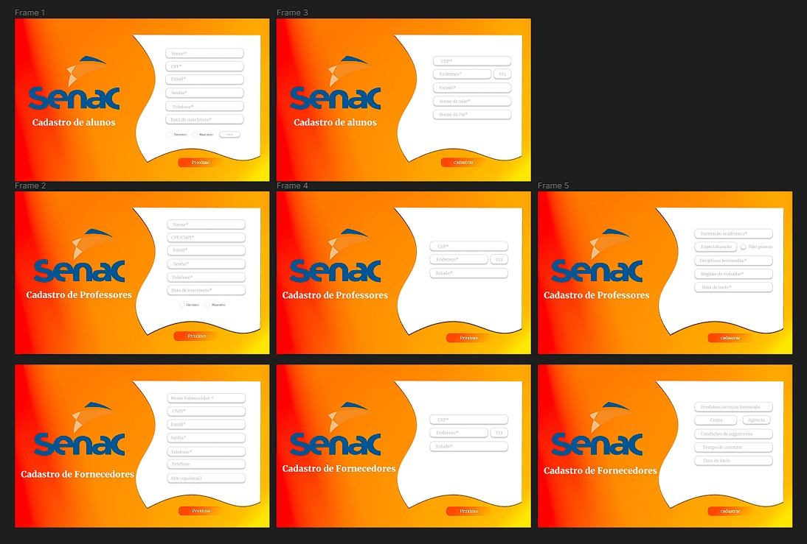

# Projeto Integrador Grupo 37
>Descrição:
Este sistema de gerenciamento completo otimiza os processos administrativos de instituições de ensino. Através de uma plataforma integrada, oferece soluções para monitoramento de entrega de recursos, comunicação por vídeo, aulas online e presenciais, segurança, administração de cursos, alunos e professores.

## Prototipo
  - Prototipo geral

    

## Cadastro de alunos
.jpeg)
