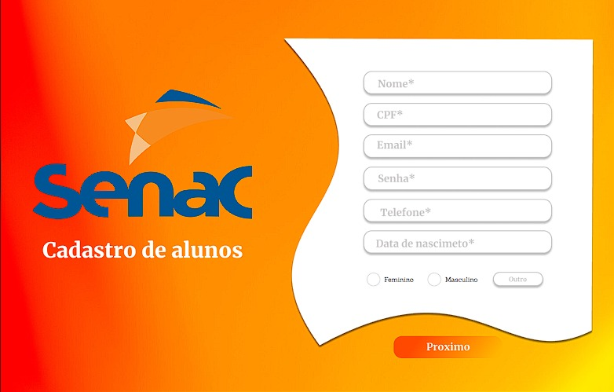
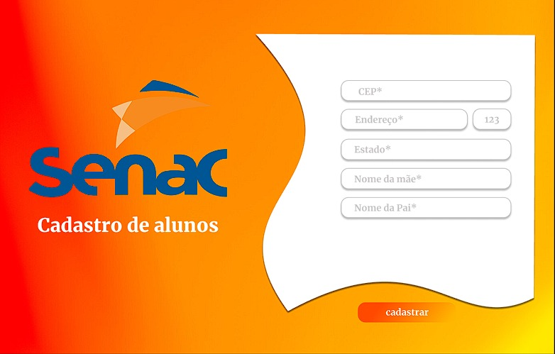
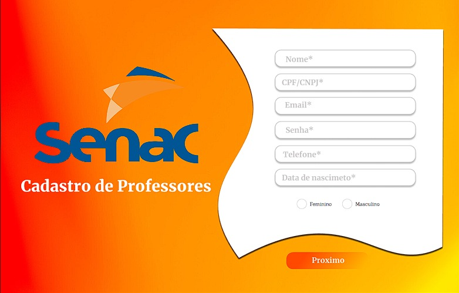
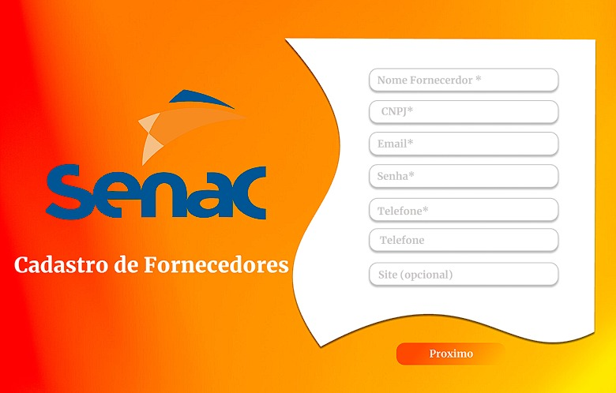
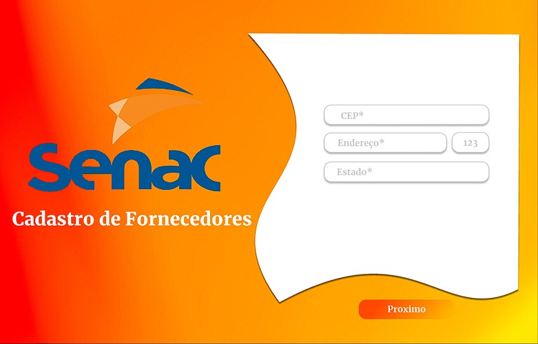
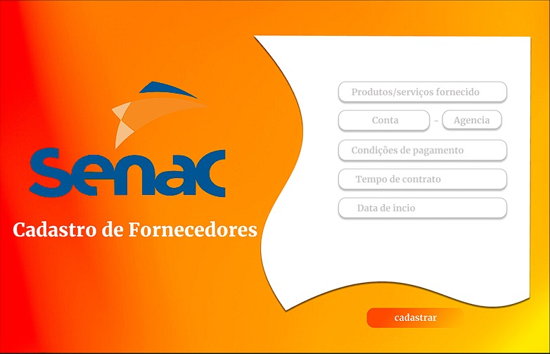

# Projeto Integrador Grupo 37
- Yago Pompeu Nunes
- Samuel Azevedo
- Victor Soares Pedroso
- Ana Paula
#

- Descrição:
>Este sistema de gerenciamento completo otimiza os processos administrativos de instituições de ensino. Através de uma plataforma integrada, oferece soluções para monitoramento de entrega de recursos, comunicação por vídeo, aulas online e presenciais, segurança, administração de cursos, alunos e professores.

## Prototipo
  - Prototipo geral

    

##
- ### Cadastro de alunos
  
 
 
 

##

- ### Cadastro de Professores
  

 

##

- ### Cadastro de Professores
  

 

##
